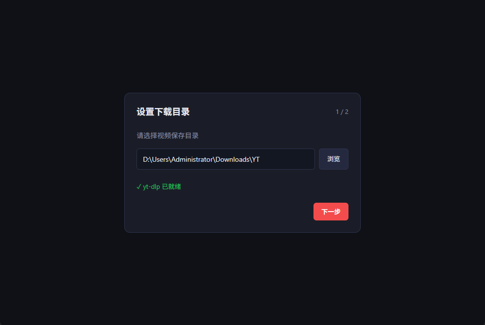
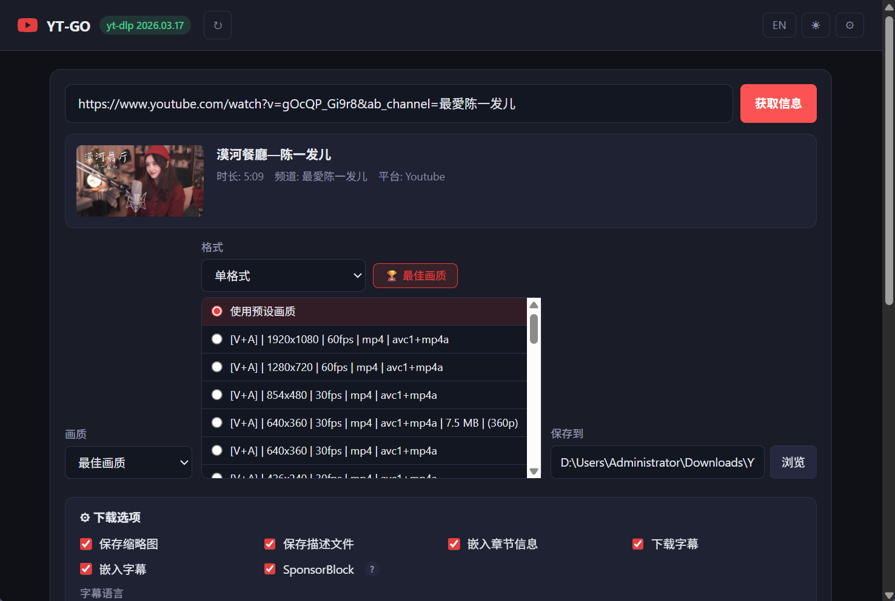

# YT-GO

[English](README.md) | [简体中文](README.zh-CN.md)

YT-GO is a cross-platform desktop YouTube downloader powered by [yt-dlp](https://github.com/yt-dlp/yt-dlp). Paste a URL, pick a quality, choose an output folder, and download — no command line needed.

## Overview

YT-GO focuses on a simple desktop workflow built on top of yt-dlp:

- Fetch video, playlist, or channel-list metadata before downloading
- Choose preset quality, a single detected format, or a combined video+audio format
- Manage multiple concurrent download tasks in one desktop app
- Keep practical settings such as proxy, cookies, rate limit, notifications, and concurrency persisted locally

## Features



- One-click metadata fetch for YouTube videos, playlist URLs, and channel video list URLs
- Generic site support: works with any URL that yt-dlp supports (Bilibili, Twitter/X, etc.)
- Video preview with title, uploader, duration, platform, and thumbnail
- Playlist and channel-list detection with batch enqueue support
- Playlist item selector with select all/none and individual checkbox selection
- Preset qualities: Best, 1080p, 720p, 480p, 360p, and audio-only (MP3)
- Format probing after metadata fetch, including:
	- single format selection with type badges [V+A], [V], [A], resolution, fps, codecs, and file size
	- combined video + audio format selection
	- smart format sorting by type, resolution, and bitrate
- Concurrent downloads with configurable max parallel tasks
- Download history search and filtering by status (all, downloading, completed, failed)
- Retry failed tasks, re-download completed tasks, or retry all failed tasks from the download list
- Cancel a running task and automatically remove it from the queue
- Real-time logs, progress, speed, ETA, and output path tracking
- Subtitle support: download subtitles with configurable languages and optional embedding into video
- Chapter embedding and SponsorBlock markers
- Optional sidecar files for video description and thumbnail
- Customizable filename template, output container format (MP4/MKV/WebM), and audio format (MP3/M4A/Opus/FLAC/WAV)
- Open the downloaded file or its folder directly after completion
- Persistent download history stored locally in SQLite
- Settings organized into five tabs: Download, Media, Network & Auth, Tools, and Appearance
- Tool center with yt-dlp update, FFmpeg detection, Node.js runtime status, and full diagnostics
- Built-in yt-dlp update check and in-app update action
- Automatic yt-dlp detection from PATH or the application directory
- English and Simplified Chinese UI

## Usage

1. Paste a video, playlist, or supported channel videos URL.
2. Click Get Info.



3. Optionally detect formats and choose either a single format or a combined video+audio pair.
4. Choose the output directory.
5. Start download, or batch-enqueue the detected collection.

## Troubleshooting

- If YouTube asks you to sign in, configure browser cookies or a cookies.txt file in Settings.
- **Cookie options**:
  - **Browser import**: Go to Settings → Network & Auth → Cookies From → select your browser (Chrome, Firefox, Edge, etc.). No file export needed.
  - **cookies.txt file**: Use a browser extension like "Get cookies.txt LOCALLY" (Chrome) or "cookies.txt" (Firefox) to export YouTube cookies, then configure the file path in Settings → Network & Auth → Cookies File.
- If some YouTube formats are missing, ensure Node.js is installed so yt-dlp can use a supported JS runtime.
- If yt-dlp is missing, install it and click Re-check in the app.

## Requirements

[yt-dlp](https://github.com/yt-dlp/yt-dlp) must be installed and available in your system `PATH`, or placed in the same directory as the YT-GO executable.

```bash
# Install yt-dlp via pip
pip install yt-dlp

# Or via winget (Windows)
winget install yt-dlp

# Or via Homebrew (macOS)
brew install yt-dlp
```

## Downloads

Download the latest release from the [Releases](https://github.com/igeekfan/YT-GO/releases) page.

| Platform | Installer | Portable |
|----------|-----------|----------|
| Windows | `YT-GO_Setup_{version}_windows_x64.exe` | `YT-GO_Portable_{version}_windows_x64.zip` |
| macOS | `YT-GO_{version}_mac_arm64.dmg` / `YT-GO_{version}_mac_intel.dmg` | - |
| Linux | `YT-GO_{version}_linux_amd64.deb` | `YT-GO_{version}_linux_amd64.AppImage` |

## Development

Requirements: Go 1.23+, Node.js 18+, and [Wails CLI](https://wails.io/docs/gettingstarted/installation)

Development mode:

```bash
wails dev
```

Build:

```bash
cd frontend && npm install && npm run build && cd ..
wails build
```

Build outputs are generated in `build/bin/`.

## Roadmap

See [PLAN.md](PLAN.md) for the detailed development roadmap and future work items.

## Stack

- [Wails v2](https://wails.io) — Go + React desktop framework
- Go
- React + TypeScript
- Vite
- Tailwind CSS + shadcn/ui
- [yt-dlp](https://github.com/yt-dlp/yt-dlp) — video downloading backend

## License

MIT

## Disclaimer

By downloading or using this project, you agree to the following terms:

**For Learning & Research Only**
This project is for personal learning, research, and data management only. Commercial use or any illegal purposes are strictly prohibited.

**Legal Compliance**
You must comply with all applicable laws including but not limited to: cybersecurity laws, data protection laws, privacy laws, copyright laws, and the platform's Terms of Service and Privacy Policy.

**Respect Copyright & Privacy**
All downloaded content copyright belongs to the original creators. Without authorization, do not use downloaded content for redistribution, commercial purposes, or any infringing activities. Do not download or share content involving others' privacy.

**No Abuse**
Do not use this tool for: large-scale data scraping, disrupting platform operations, bypassing security mechanisms, spreading illegal content, or harassing creators.

**Data Security**
This tool does not collect, upload, or share any user data. Cookies are stored locally only—do not share them publicly.

**Account Risk**
Using automation tools may violate platform Terms of Service and could result in account suspension. You assume all risks.

**Platform Rules First**
Platforms reserve the right to adjust APIs and anti-crawling policies. Please respect platform rules, do not send high-frequency requests, and keep download intervals above the default rate limit.

**No Warranty**
This software is provided "AS IS" without warranties. The author is not liable for any consequences including account suspension, data loss, legal disputes, or losses caused by using this tool.

**If you do not agree to these terms, stop using this project immediately.**