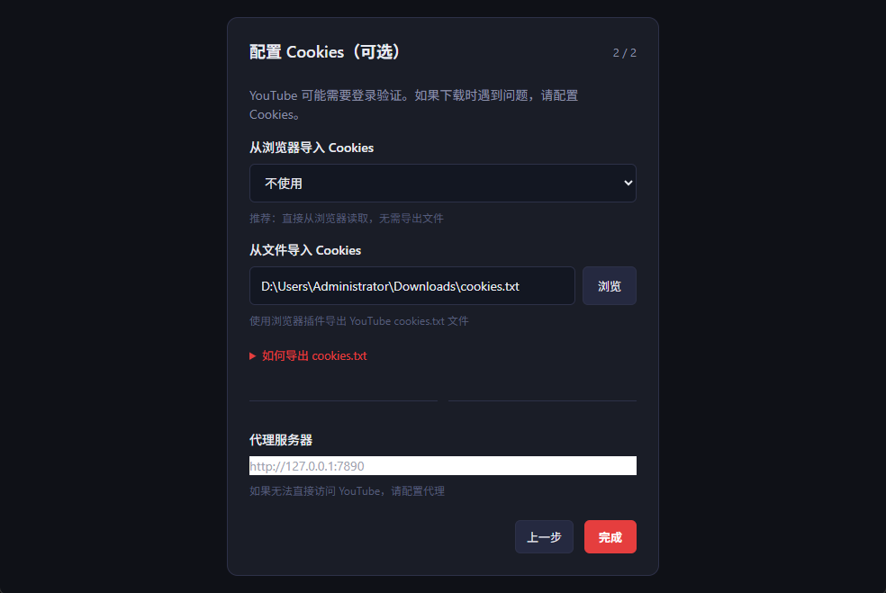
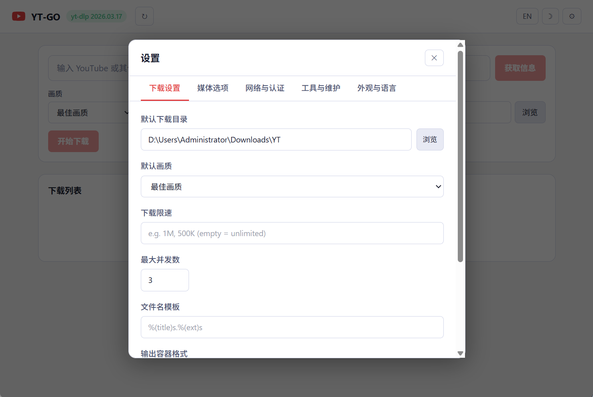
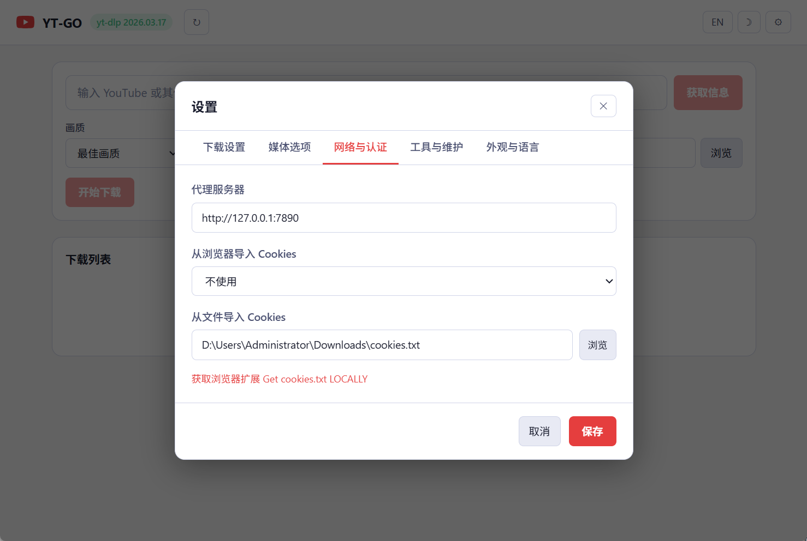
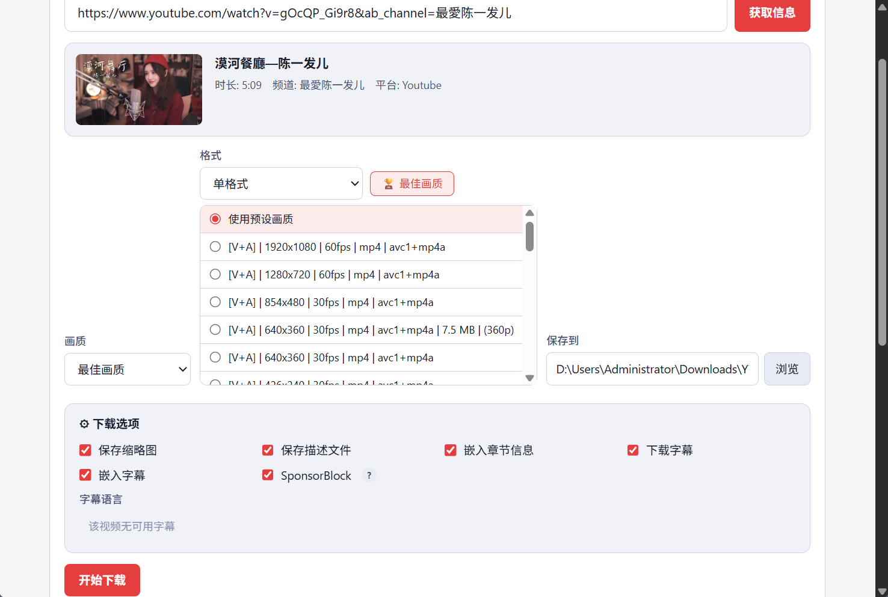

# YT-GO

[English](README.md) | [简体中文](README.zh-CN.md)

YT-GO 是一款跨平台桌面视频下载工具，基于 [yt-dlp](https://github.com/yt-dlp/yt-dlp) 驱动。粘贴链接、选择画质，一键下载，无需命令行。

## 支持平台

YT-GO 继承 **yt-dlp 支持的全部平台**（1800+ 站点），包括：

- **视频**：YouTube、TikTok、抖音、Bilibili、Twitter/X、Instagram、Facebook、Vimeo、Dailymotion 等
- **音乐**：Spotify、SoundCloud、Apple Music、YouTube Music 等
- **直播**：Twitch、YouTube Live 等

## 功能特性

- 一键获取视频、播放列表、频道链接的元信息
- 展示标题、上传者、时长、平台和缩略图
- **预设画质**：最佳、1080p、720p、480p、360p、仅音频（MP3）
- 格式探测，支持单格式或视频+音频组合选择
- 播放列表和频道批量下载，支持条目选择
- 支持配置并发数同时下载多个任务
- 下载历史：搜索、筛选、重试、重新下载
- 实时进度、速度、预计剩余时间
- 字幕下载：语言选择和可选嵌入视频
- 章节信息写入和 SponsorBlock 标记
- 附随文件：缩略图和描述导出
- 代理、Cookies、自定义文件名、容器格式支持
- 持久化设置：输出目录、下载选项、外观主题
- 内置 yt-dlp 和 FFmpeg 检测，一键更新
- 中英文界面

## 使用方式

1. 粘贴视频、播放列表或支持的链接。
2. 点击 **获取信息**。
3. 选择画质预设或指定格式。
4. 设置保存目录。
5. 点击 **下载**。

## Cookie 导出（抖音/TikTok 必需）

1. 安装浏览器扩展 [Get cookies.txt LOCALLY](https://chromewebstore.google.com/detail/get-cookiestxt-locally/fcnalolhneacngmkjfgnmalmefjancoh)
2. 打开 douyin.com 并登录，随意播放一个视频
3. 点击扩展图标 → 导出为 Netscape 格式（如 `E:\cookies.txt`）
4. 在设置 → 网络与认证 中配置路径

## 前置要求

需安装 [yt-dlp](https://github.com/yt-dlp/yt-dlp)：

```bash
# via pip
pip install yt-dlp

# Windows
winget install yt-dlp

# macOS
brew install yt-dlp
```

## 下载

| 平台 | 安装包 | 便携版 |
|------|--------|--------|
| Windows | `YT-GO_Setup_{version}_windows_x64.exe` | `YT-GO_Portable_{version}_windows_x64.zip` |
| macOS | `YT-GO_{version}_mac_arm64.dmg` / `YT-GO_{version}_mac_intel.dmg` | - |
| Linux | `YT-GO_{version}_linux_amd64.deb` | `YT-GO_{version}_linux_amd64.AppImage` |

从 [Releases](https://github.com/igeekfan/YT-GO/releases) 获取最新版本。

## 开发

```bash
wails dev
```

## 构建

```bash
# 桌面应用
wails build

# Web 服务器
go build -tags web -o build/bin/yt-go-web .
```

## Docker

```bash
docker build -t yt-go:local .
docker run --rm -p 8080:8080 yt-go:local
```

## 常见问题

- **格式不全**：确保已安装 Node.js，以便 yt-dlp 使用 JS 运行时。
- **未检测到 yt-dlp**：将其放置在应用目录，或点击工具中的"重新检测"。

## 技术栈

- [Wails v2](https://wails.io) — Go + React 桌面
- [yt-dlp](https://github.com/yt-dlp/yt-dlp) — 视频下载后端

## 许可证

MIT

## 免责声明

下载或使用本项目，即表示您已充分理解并同意以下全部条款。

**仅供学习研究**
本项目仅用于技术研究、学习交流与个人数据管理目的。严禁将本项目用于任何商业目的或违法用途。

**合法合规使用**
使用者须自觉遵守中华人民共和国相关法律法规，包括但不限于《网络安全法》《数据安全法》《个人信息保护法》《著作权法》《互联网信息服务管理办法》等，以及各视频平台的《用户服务协议》和《隐私政策》。

**尊重版权与隐私**
本工具下载的所有内容，版权均归原作者及平台所有。未经内容创作者授权，禁止将下载内容用于二次传播、商业变现、剪辑混剪、售卖等侵权行为。不得下载、传播、使用涉及他人隐私的视频内容。

**禁止滥用**
严禁利用本工具从事以下行为：大规模抓取平台数据、干扰平台正常运营、绕过平台安全机制、传播违法违规内容（谣言、色情、暴力等）、骚扰创作者或侵害任何第三方合法权益。

**数据安全**
本工具不会主动收集、上传或分享任何用户数据。Cookie 等敏感信息仅存储在本地，请妥善保管，切勿分享给他人或上传至公开环境。

**账号风险**
使用自动化工具访问视频平台可能违反平台服务条款，存在封禁账号的风险。使用者需自行评估并承担该风险。

**平台规则优先**
各平台对 API 及反爬策略享有随时调整的权利。请尊重平台规则，不要使用本工具对平台服务器发起高频请求或进行压力测试。建议下载间隔不低于默认速率限制。

**责任豁免**
本项目以"现状"提供，不附带任何明示或暗示的保证。作者不对以下情况承担任何责任：因使用本工具导致的账号封禁、数据丢失、法律纠纷、经济损失，或因平台 API 变更导致工具失效等。

**若您不同意上述任何条款，请立即停止使用并删除本项目。**

## 图片集

| <a href="images/zh-CN/start-1.png"></a> | <a href="images/zh-CN/start-2.png"></a> | <a href="images/zh-CN/getinfo.png"></a> |
|:---:|:---:|:---:|
| 主界面 | 播放列表选择 | 获取信息 |

| <a href="images/zh-CN/setting-download.png"></a> | <a href="images/zh-CN/setting-network.png"></a> | <a href="images/zh-CN/light.png"></a> |
|:---:|:---:|:---:|
| 下载设置 | 网络设置 | 浅色主题